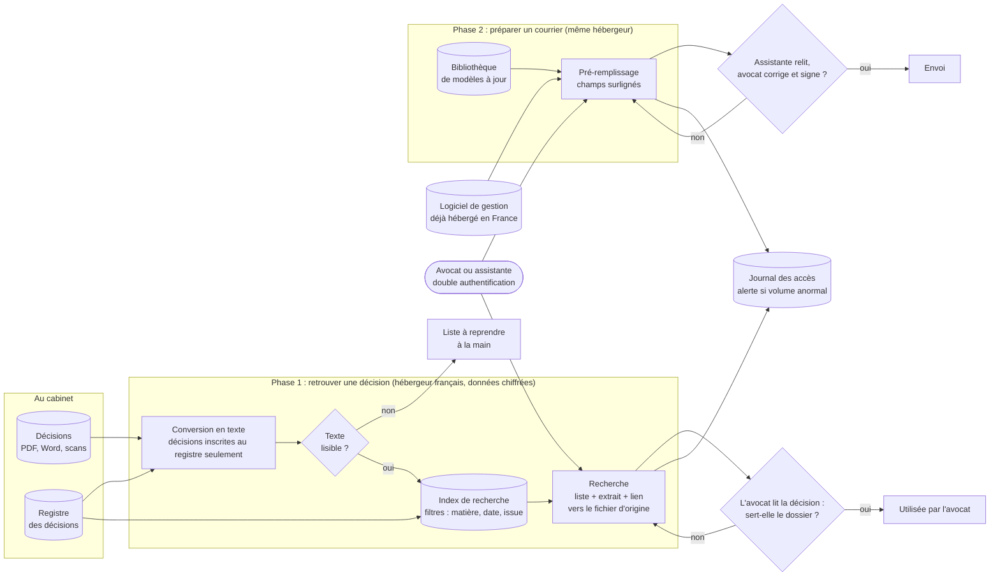

# Schéma d'architecture cible : Cabinet Maître Devalle

> Niveau composants : des familles d'outils, pas des logiciels précis (choisis en M8-B2). Deux temps : retrouver une décision d'abord, préparer un courrier ensuite. Les losanges sont les points où un humain contrôle.

**Composants**

| Composant | Rôle | Risque traité (§4 du cadrage) |
|---|---|---|
| Conversion en texte | Lit les décisions, scans compris, mais seulement celles inscrites au registre ; signale les illisibles | 🟠 décision non trouvée ; 🟡 fausse décision glissée |
| Index de recherche | Copie consultable des décisions, chiffrée, chez un hébergeur français, avec les filtres du registre | 🔴 fuite du secret |
| Recherche | Renvoie des décisions existantes avec le lien vers l'original, jamais un texte rédigé | 🔴 décision inventée |
| Bibliothèque de modèles | Modèles de courriers à jour, tenus par une assistante référente | 🟠 outil abandonné |
| Pré-remplissage | Remplit les champs depuis le logiciel de gestion (si l'éditeur le permet), surlignés pour la relecture | 🟡 courrier erroné |
| Journal des accès | Trace qui consulte quoi, alerte sur un volume anormal, relu chaque mois par le prestataire | 🔴 fuite ; aspiration du fonds |

**Ce qu'on n'a PAS mis** (et pourquoi) :

- **IA générative** (assistant conversationnel, résumés, rédaction) : elle peut inventer une décision, ce que le cabinet exclut. Voir le §5 du cadrage.
- **Recherche « par le sens »** (base vectorielle) : pas en première version. Elle sera ajoutée seulement si la recherche par mots et filtres rate trop souvent la bonne décision sur le jeu de test (seuil au §6).
- **Entraînement d'un modèle** : il n'y a rien à prédire, et le classement du registre suffit comme filtres.
- **Serveur de calcul dédié** : inutile pour 2 000 documents.
- **Cloud américain** : exclu par le cabinet.
- **Développement sur mesure** : hors budget ; un logiciel existant, paramétré, suffit.
