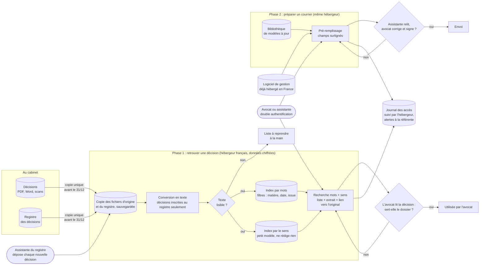

# Schéma d'architecture cible : Cabinet Maître Devalle

> Niveau composants : des familles d'outils, pas des logiciels précis (choisis en M8-B2). Deux temps : retrouver une décision d'abord, préparer un courrier ensuite. Les losanges sont les points où un humain contrôle. Depuis l'imprévu (départ du prestataire au 31/12), rien ne tourne sur le serveur du cabinet.

**Composants**

| Composant | Rôle | Risque traité (partie risques du cadrage) |
|---|---|---|
| Copie des fichiers d'origine | Reprise unique des décisions et du registre avant le 31/12, puis dépôt de chaque nouvelle décision par l'assistante ; sauvegardée par l'hébergeur | 🟠 perte des décisions ; 🟡 fausse décision glissée |
| Conversion en texte | Lit les décisions, scans compris, mais seulement celles inscrites au registre ; signale les illisibles | 🟠 décision non trouvée |
| Index par mots | Retrouve les décisions qui contiennent les mots cherchés, avec les filtres du registre | 🔴 fuite du secret (chiffré, chez l'hébergeur) |
| Index par le sens | Petit modèle qui rapproche la question des décisions qui en parlent avec d'autres mots ; ne rédige rien | 🟠 décision non trouvée |
| Recherche | Renvoie des décisions existantes avec le lien vers l'original, jamais un texte rédigé | 🔴 décision inventée |
| Bibliothèque de modèles | Modèles de courriers à jour, tenus par une assistante référente | 🟠 outil abandonné |
| Pré-remplissage | Remplit les champs depuis le logiciel de gestion (si l'éditeur le permet), surlignés pour la relecture | 🟡 courrier erroné |
| Journal des accès | Trace qui consulte quoi ; suivi par l'hébergeur, alertes envoyées à la référente du cabinet | 🔴 fuite ; aspiration du fonds |

**Ce qu'on n'a PAS mis** (et pourquoi) :

- **IA qui rédige** (assistant conversationnel, résumés, RAG complet) : elle peut mal résumer ou inventer une référence, ce que le cabinet exclut. Voir la partie architecture et sobriété du cadrage.
- **Entraînement d'un modèle** : il n'y a rien à prédire ; le modèle « par le sens » est un modèle standard, utilisé tel quel.
- **Serveur de calcul dédié** : inutile pour 2 000 documents.
- **Installation sur le serveur du cabinet** : plus personne pour l'entretenir après le 31/12.
- **Cloud américain** : exclu par le cabinet.
- **Développement sur mesure** : hors budget ; un logiciel existant, paramétré, suffit.
